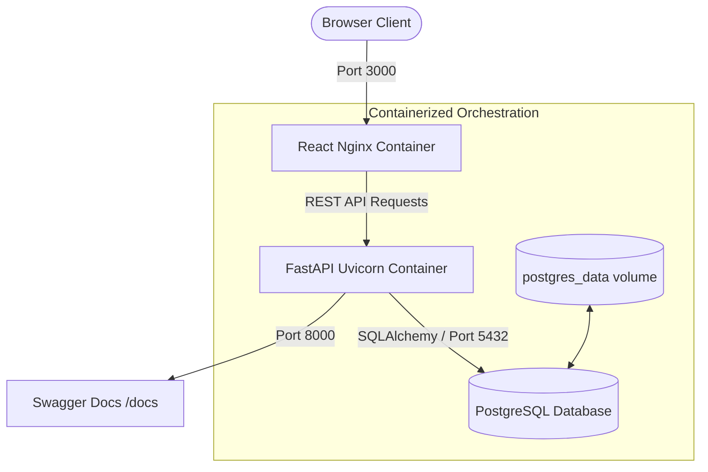

# Ethara.ai - Containerized Inventory & Order Management System

Welcome to the **Production-Ready Containerized Inventory & Order Management System**. This repository contains a full-stack, enterprise-grade solution engineered with a **FastAPI Python backend**, a **React JavaScript frontend**, and a **PostgreSQL relational database**, fully orchestrated and managed via **Docker Compose**.

---

## 🌟 Key Features

- **Product Catalog Management:** Complete CRUD capabilities, enforced SKU uniqueness, real-time inventory count checks, and price tracking.
- **Customer Directory:** Register client profiles, enforce email uniqueness, and maintain active contact cards.
- **Transaction-Safe Order Checkout:** Multi-item purchase constructor with backend subtotal and grand total calculations. 
- **Concurrency & Race Condition Prevention:** Employs row-level write locks (`SELECT ... FOR UPDATE`) in database transactions, preventing stock from falling below zero or double-allocating stock.
- **Inventory Restoration:** Order cancellation/deletion automatically returns allocations to catalog stocks.
- **Real-Time KPI Dashboard:** High-level metrics counters (Total Products, Customers, Orders) and automatic warning lists for low-stock items.
- **Glassmorphism CSS Design:** Sleek modern Dark/Light theme, glowing inputs, responsive layouts, hover scales, and sliding alerts without heavy styling frameworks.

---

## 📐 System Architecture

Below is a detailed representation of the service dependencies, network bindings, and data flow:



---

## 📂 Repository Directory Tree

```
ethara.ai/
├── docker-compose.yml          # Orchestrates backend, frontend, and db
├── .gitignore                  # Git exclusions for python, node, and databases
├── README.md                   # Complete system documentation (This file)
├── backend/
│   ├── Dockerfile              # Multi-stage production Python Dockerfile
│   ├── .dockerignore           # Excludes local venv and temporary files
│   ├── requirements.txt        # FastAPI, SQLAlchemy, psycopg2-binary, etc.
│   └── app/
│       ├── __init__.py
│       ├── main.py             # FastAPI entry point, CORS, and routers
│       ├── config.py           # Environment variables manager (Pydantic Settings)
│       ├── database.py         # SQLAlchemy Engine & Local Session generator
│       ├── models.py           # Database Tables (Product, Customer, Order, OrderItem)
│       ├── schemas.py          # Request & Response Pydantic Validation models
│       ├── crud.py             # Transaction-safe database controllers
│       └── test_main.py        # Automated SQLite in-memory unit tests
└── frontend/
    ├── Dockerfile              # Multi-stage production Nginx Alpine Dockerfile
    ├── .dockerignore           # Excludes node_modules and builds
    ├── nginx.conf              # SPA route-fallback Nginx configuration
    ├── package.json            # React & Lucide dependencies
    ├── vite.config.js          # Port 3000 & Host mapping config
    ├── index.html              # Custom Google Font loads & SEO meta headers
    └── src/
        ├── main.jsx            # React root mount
        ├── App.jsx             # layout state-holder & API sync
        ├── App.css             # Clashed styles container (Cleared)
        ├── index.css           # Premium vanilla CSS styling system
        └── components/
            ├── Dashboard.jsx   # KPI counters & low-stock indicator list
            ├── ProductList.jsx # Product CRUD table & edit modals
            ├── CustomerList.jsx# Customer registration & search filter
            ├── OrderList.jsx    # Orders timeline & visual invoice breakdown
            ├── OrderCreate.jsx  # Multi-item interactive sales builder
            ├── Notification.jsx # Sliding toast alerts
            └── Navbar.jsx       # Side-nav menu layout
```

---

## 🚀 Getting Started

### Option A: The Docker Compose Way (Recommended)

Ensure you have **Docker** and **Docker Compose** installed on your host system.

1. **Clone the Repository:**
   ```bash
   git clone <repository_link>
   cd ethara.ai
   ```

2. **Boot All Services:**
   ```bash
   docker compose up --build
   ```
   *This command compiles the frontend and backend assets into minimal container layers, launches a PostgreSQL database, configures persistent named volumes, and validates startup sequences.*

3. **Access the Applications:**
   - **Interactive Frontend Portal:** Open [http://localhost:3000](http://localhost:3000)
   - **Interactive API Swagger Documentation:** Open [http://localhost:8000/docs](http://localhost:8000/docs)

---

### Option B: Local Manual Execution (Development)

#### 1. Backend Setup:
1. Navigate to the backend folder:
   ```bash
   cd backend
   ```
2. Create and activate a Python virtual environment:
   ```bash
   python -m venv venv
   # On Windows:
   venv\Scripts\activate
   # On macOS/Linux:
   source venv/bin/activate
   ```
3. Install dependencies:
   ```bash
   pip install -r requirements.txt
   ```
4. Run the API (Using an automatic local file DB for quick start):
   ```bash
   uvicorn app.main:app --reload --host 127.0.0.1 --port 8000
   ```

#### 2. Frontend Setup:
1. Navigate to the frontend folder:
   ```bash
   cd ../frontend
   ```
2. Install npm packages:
   ```bash
   npm install
   ```
3. Boot the Vite React server:
   ```bash
   npm run dev
   ```
4. Access the web app at [http://localhost:3000](http://localhost:3000) (proxying to the API running on `http://localhost:8000`).

---

## 🧪 Running Automated Unit Tests

A comprehensive testing pipeline utilizing isolated SQLite databases is included to verify endpoints and transaction integrity.

1. **Activate Backend Virtual Environment** (See manual execution guide).
2. **Install Testing Library:**
   ```bash
   pip install pytest httpx
   ```
3. **Execute Test Suite:**
   ```bash
   pytest app/test_main.py -v
   ```
   *This runs test suites validating unique SKU rejects, unique email blocks, price calculations, order checkouts, stock depletions, and stock restorations on cancel.*

---

## 🏢 Business Logic Specifications

- **Unique SKU/code:** `POST /products` will yield `400 Bad Request` if duplicate codes are provided.
- **Unique Customer Email:** `POST /customers` will raise `400 Bad Request` if emails overlap.
- **Positive Field Constraints:** Inputs are validated on both frontend models and backend Pydantic schemas (Prices must be `>= 0.00`, Quantities must be `>= 0` for products and `>= 1` for orders).
- **Concurrency Locks:** Order checkouts lock selected products in SQL (`with_for_update()`), ensuring that inventory counts can never fall negative under highly concurrent purchase loads.
- **Automatic Pricing:** Product pricing is pulled from the database at the precise moment of execution, preventing client-side spoofing.
- **Restoration of Stock:** Cancelling an order restores the items immediately back to active catalog stock levels.
